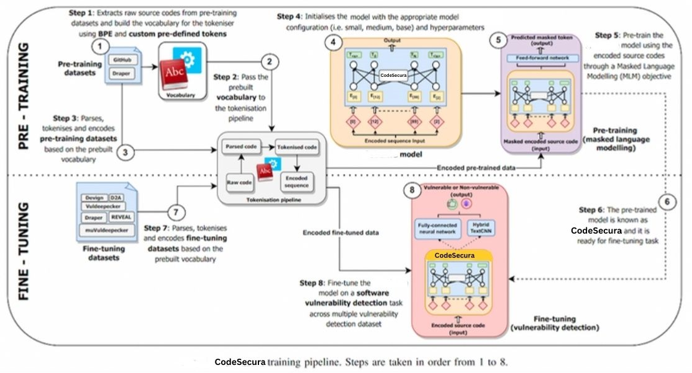

# CodeSecura: Simplified Source Code Pre-Training for Vulnerability Detection

## Overview
This paper presents CodeSecura, a deep learning approach to detect security vulnerabilities in source code. Our approach pre-trains a RoBERTa model with a custom tokenisation pipeline on real-world code. The model learns a deep knowledge representation of the code syntax and semantics, which we leverage to train vulnerability detection classifiers. We evaluate our approach on binary and multi-class vulnerability detection tasks across several datasets (Vuldeepecker, Draper, REVEAL and muVuldeepecker) and benchmarks (CodeXGLUE and D2A). The evaluation results show that CodeSecura achieves state-of-the-art performance and outperforms existing approaches across different datasets, despite its conceptual simplicity, and limited cost in terms of size of training data and number of model parameters.

## Data
We provide all data required by CodeSecura.  
This includes:
 - Tokenizer training data
 - Pre-training data
 - Fine-tuning data

## Models
We provide all models pre-trained and fine-tuned by CodeSecura.  
This includes:
 - Trained tokenisers
 - Pre-trained CodeSecura model (core representation knowledge)
 - Fine-tuned CodeSecura-MLP and CodeSecura-CNN models

## Pre-requisites and requirements

In general, we used this version of packages when running the experiments:

 - Python 3.12.1
 - Pytorch 2.1.2
 - Transformers 4.37.1
 - Tokenizers 0.15.1
 - Libclang 16.0.6

For an exhaustive list of all the packages, please refer to [requirements.txt]

